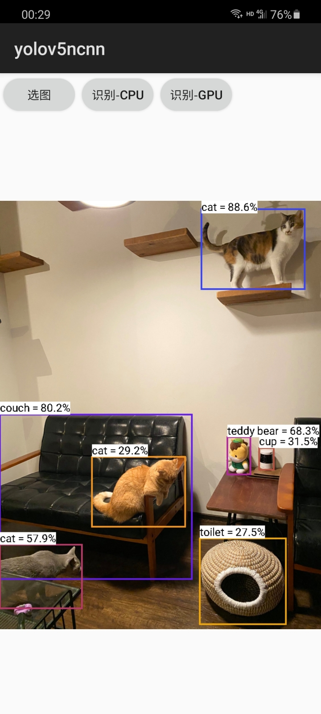

# ncnn-android-yolov5-lite

-------------------------------------------------------------------------

因为我要推理两个不同的yolov5模型

原版的加载推理是同一个

所以在原版的基础上做了些修改

改了后处理部分和一些参数传递

分离了原版jni的部分，写成了cpp来调用推理

因此只需简单修改参数就可以推理多个yolov5模型

使用方法和nihui版的yolov5一样

把ncnn库放进去然后修改cmake即可使用

该版本是推理两个yolov5-lite模型的

运行前还需要：

修改target_size

修改模型路径

修改.param文件中permute层的名字（或者改推理的时候ex, out获取层的名字）

修改自己模型.param文件中reshape层动态获取

-------------------------------------------------------------------------

The YOLOv5 object detection

this is a sample ncnn android project, it depends on ncnn library only

https://github.com/Tencent/ncnn

## how to build and run
### step1
https://github.com/Tencent/ncnn/releases

download ncnn-android-vulkan.zip or build ncnn for android yourself

### step2
extract ncnn-android-vulkan.zip into app/src/main/jni or change the ncnn_DIR path to yours in app/src/main/jni/CMakeLists.txt

### step3
open this project with Android Studio, build it and enjoy!

## screenshot

